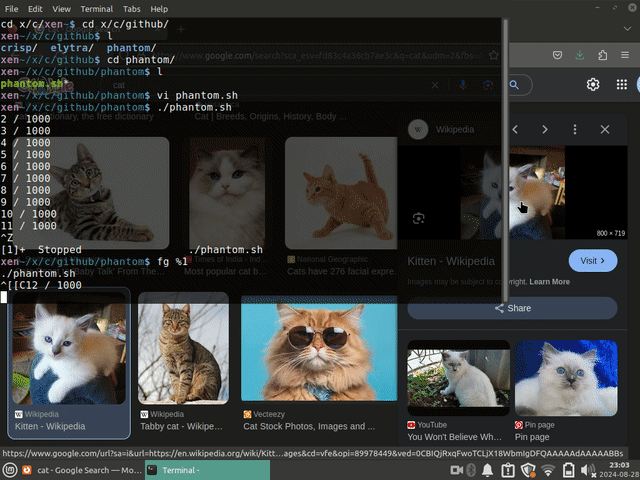

### PHANTOM

- Bash bot to auto-download Google search images (1 in every 6 seconds)
- Auto-rename feature to avoid collisions
- Easy configuration for different kinds of search engines
- Great for generating image datasets without use of scrapers

1. Install Dependencies:
```bash
$ sudo apt install xdotool
```

2. Open the image section of a topic. Reconfigure with getmouseposition if necessary:
```bash
$ cd src; chmod 755 phantom.sh
$ ./phantom.sh
```

3. Ctrl-C to terminate. Remember the image number to start again from that number. (Reconfigure from source. Common sense ;)

Phantom in action:


PS: You can configure mouse positions for different search engines. Refer the source file.
